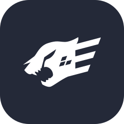
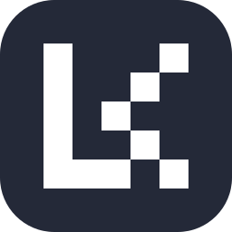

<link rel="stylesheet" type='text/css' href="https://cdn.jsdelivr.net/gh/devicons/devicon@latest/devicon.min.css" />

  <h1>Hi, I'm Felipe 👾</h1>
  <h3>Fullstack Developer | AI Enthusiast</h3>
  
I build software used by <b>170+ city governments</b> in Brazil, from the React UI all the way down to the phone system.

  <table>
    <tr>
      <td align="center" width="160"><h2>170+</h2>city governments on the platform</td>
      <td align="center" width="160"><h2>13</h2>services I ship to</td>
      <td align="center" width="160"><h2>168</h2>tickets closed since Aug 2026</td>
      <td align="center" width="160"><h2>1,800+</h2>commits, built with Claude Code</td>
    </tr>
  </table>

  <h2>About me</h2>

♾️ • I maintain and build **Infinity**, a multi-tenant omnichannel platform for phone, WhatsApp, email, video and AI agents  
⚙️ • I work across the whole stack: React, NestJS, FreeSWITCH telephony, LLM agents, messaging and mobile  
🤖 • I use **Claude Code** every day, and I write some of the hooks and skills our team's agents run on

### What I've built

<table>
  <tr>
    <td width="50%" valign="top">
      <h4>- AI agents that answer the phone</h4>
      Voice agents that triage calls, pass them to another AI agent mid-call, schedule callbacks and open a ticket when no one is available.
        
      <code>Gemini Live</code> <code>Claude</code> <code>FreeSWITCH</code> <code>NestJS</code>
    </td>
    <td width="50%" valign="top">
      <h4>- Docs & Sheets inside the platform</h4>
      Real-time collaborative documents and spreadsheets with comments, formulas, live cursors and .xlsx/CSV import.
        
      <code>Yjs</code> <code>TipTap</code> <code>Univer</code> <code>WebSockets</code>
    </td>
  </tr>
  <tr>
    <td width="50%" valign="top">
      <h4>- Click-to-call API</h4>
      A public API that dials a number, detects voicemail and only connects the caller when a real person picks up.
        
      <code>REST</code> <code>FreeSWITCH</code> <code>ESL</code> <code>AMD</code>
    </td>
    <td width="50%" valign="top">
      <h4>- WhatsApp calls in the PBX</h4>
      WhatsApp voice calls come into the phone system like any other line, with recording, hold, transfer, blocklist and call reports.
        
      <code>Meta Calling API</code> <code>SIP</code> <code>WebRTC</code>
    </td>
  </tr>
</table>

<h2>Highlights</h2>

🔧 • **28,272 → 0 lint errors across 12 repos.** I also fixed 15 type errors and 16 failing tests, and brought the check cycle down from 49 to 33 minutes. The best find was a safety test that had always passed because its regex contained an invisible backspace character.  
🔁 • **Got city hall phone lines answering again in 34 cities.** 87 queues, including health clinics, pharmacies and switchboards, had silently lost every agent. I traced it to an ID mismatch in the SIP registration check and fixed it live on both telephony nodes. The number of empty queues went to zero.  
🔒 • **Security fixes for a platform that holds data for 170+ governments.** I closed cross-tenant access holes and hardened the SIP perimeter against toll-fraud scanners.
<h2>Tech stack</h2>

  
  
  
   
  
  
  
  
  
  
  
  
   
  
  
  
  
  
  
  
  
   
  
  
  
  
  
  
  
  
  
   
  
  
  
  
  

<h2>A bit more</h2>

🥉 National Math Olympiad (OBMEP) medalist (<a href="http://premiacao.obmep.org.br/17obmep/verRelatorioPremiadosBronze.do.htm#:~:text=Felipe%20Bitencourt%20Ribeiro" target="blank">link</a>) 
📚 Co-founder of Scritus, a literary social network

